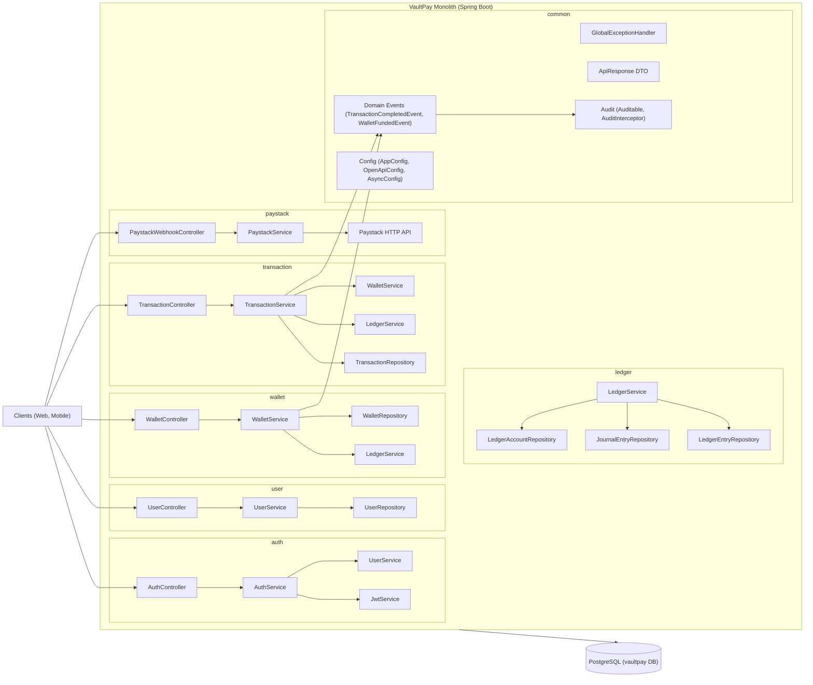

# VaultPay Architecture

This document describes how the VaultPay monolithic Spring Boot application is structured, how modules communicate, and how the system is designed for resilience and scalability.

## Scope and Assumptions

- **Monolith only**: single Spring Boot service (no external API gateway, no microservices).
- **Feature-based modules** under `src/main/java/com/vaultpay/`: auth, user, wallet, ledger, transaction, paystack, common.
- Communication is **in-process** (Spring beans calling each other), with **domain events** for decoupling.
- **PostgreSQL** is the single primary database; **Paystack** is the only external payment gateway.

## Architecture Diagram (Module View)

The diagram shows how clients hit controllers, which delegate to services and repositories, and how cross-cutting concerns and events fit in.

## Communication and Behavior

### Request flow (happy path)

- **Client** → **Controller** (HTTP, validation, DTOs) → **Service** (business logic) → **Repository** (JPA) → **PostgreSQL**.
- Controllers never call repositories directly; all business rules live in services (SRP/SOLID).

### Cross-module calls (in-process, via services)

- **TransactionService** calls **WalletService** and **LedgerService** to orchestrate transfers, deposits, and withdrawals.
- **AuthService** calls **UserService** (for user data) and **JwtService** (for tokens).
- **WalletService** calls **LedgerService** for balance and journal operations.

### Events for decoupling

- **TransactionService** and **WalletService** publish domain events (e.g. `TransactionCompletedEvent`, `WalletFundedEvent`).
- Listeners in **common.event** (or other services) consume these for side effects (audit logging, notifications) without coupling core write paths.

## Resilience Strategy (Within the Monolith)

### Database resilience

- **Transactions**: Critical flows (transfers, funding, withdrawals) run inside `@Transactional` so ledger, wallet balance, and transaction records stay consistent; any failure rolls back.
- **Idempotency keys**: Payment and transfer endpoints accept idempotency keys so retries do not double-process.

### External Paystack resilience

- **PaystackService**: HTTP calls to Paystack use timeouts, retries, and a circuit breaker (e.g. Resilience4j) so Paystack slowness or failures do not bring down the monolith.
- **PaystackWebhookController**: Webhook handling is idempotent and verifies Paystack signatures before updating wallets/transactions.

### Internal robustness

- **Structured exceptions**: Business errors use `common.exception` types and are mapped by **GlobalExceptionHandler** to stable API responses.
- **Async operations**: When used, async work is configured via **AsyncConfig** with bounded thread pools.

## Scalability Strategy (Monolithic)

- **Stateless app instances**: Auth state is in JWT; no in-memory HTTP sessions. Multiple instances can run behind a load balancer.
- **Database-first consistency**: Monetary state lives in PostgreSQL with **LedgerService** as the single source of truth.
- **Caching and read performance**: Wallet balance is derived from the ledger with a cached `Wallet.balance` updated atomically (e.g. pessimistic locking). A read cache (e.g. Redis) can be added behind an interface later without changing service APIs.
- **Future evolution**: Clear module boundaries make it possible to extract a domain (e.g. ledger) into a separate service later if needed.

## Resilience mechanisms map

This section maps each resilience mechanism to specific classes and files. Use it when implementing or changing transaction, payment, or webhook behaviour.

| Mechanism | Where it lives | Behaviour |
|-----------|----------------|-----------|
| **Transactions** | **TransactionService** (implementation) | Any method that changes ledger, wallet balance, or `Transaction` records must run inside a single `@Transactional` boundary (e.g. `transfer`, `withdraw`, `completeFunding`). Use `@Transactional(rollbackFor = Exception.class)` so any failure rolls back the full unit of work. |
| **Idempotency** | **Transaction** entity, **TransactionRepository**, **TransactionController** / **TransactionService** | `Transaction` has `idempotencyKey` (unique). `TransactionRepository.findByIdempotencyKey(String)` exists. For `transfer`, `fund`, and `withdraw`: controller accepts `Idempotency-Key` header (or request body field); service checks `findByIdempotencyKey` before processing; if present, return the existing transaction response instead of creating a new one. |
| **Paystack HTTP resilience** | **PaystackService** (implementation), **ResilienceConfig** | Outbound calls from PaystackService to Paystack API (e.g. initialize, verify) must use: (1) connection/read timeouts, (2) retries with backoff (Resilience4j `@Retry` or `Retry` decorator), (3) circuit breaker (Resilience4j `@CircuitBreaker`) so repeated Paystack failures do not exhaust threads or cascade. Configuration lives in `common.config.ResilienceConfig` and `application*.yml` (e.g. `resilience4j.*`). |
| **Webhook signature and idempotency** | **PaystackWebhookController**, **PaystackService** | Before applying any webhook event: (1) verify payload with `PaystackService.verifyWebhookSignature(payload, signature)`; reject with 401 if invalid. (2) Make handling idempotent: e.g. for `charge.success`, check by payment reference whether the wallet has already been credited (e.g. existing `Transaction` or ledger state); if yes, return 200 without changing state. |
| **Structured errors** | **GlobalExceptionHandler**, **common.exception** | All business failures use exceptions from `common.exception` (e.g. `InsufficientFundsException`, `ResourceNotFoundException`). **GlobalExceptionHandler** maps them to stable `ApiResponse` with `success`, `message`, `errorCode`, `path`, `requestId`. No raw stack traces or ad-hoc error bodies in API responses. |
| **Async bounds** | **AsyncConfig** | Any `@Async` or programmatic async work uses the executor defined in **AsyncConfig** (bounded thread pool, configurable size) so async tasks do not unboundedly grow under load. |

### Implementation checklist for critical paths

- **TransactionService implementation**: `@Transactional` on `transfer`, `withdraw`, `completeFunding`; at start of each, if `idempotencyKey` is provided, `findByIdempotencyKey` → return existing response or proceed.
- **PaystackService implementation**: Wrap every HTTP call to Paystack in a Resilience4j-decorated call (retry + circuit breaker); use timeouts on `RestTemplate` or WebClient.
- **PaystackWebhookController**: Call `verifyWebhookSignature` first; then resolve event by reference and skip if already processed (idempotent).

## Related Documentation

- [README.md](README.md) — Getting started, tech stack, project structure.
- Folder structure and double-entry ledger behaviour are described in the project’s folder-structure plan.
