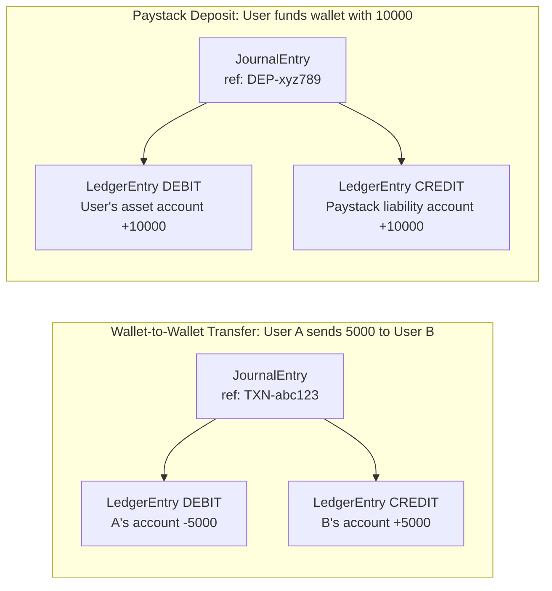

# VaultPay Neobank -- Folder Structure

## Tech Stack

- **Java 17** + **Spring Boot 3.x** (Web, Security, Data JPA, Validation)
- **PostgreSQL** (primary database)
- **Flyway** (schema migrations)
- **Spring Security + JWT** (auth)
- **Paystack API** (payment gateway)
- **Docker + Docker Compose** (local dev and deployment)
- **Springdoc OpenAPI** (Swagger docs)
- **Testcontainers** (integration tests with real Postgres)

## Architecture Principles

- **Feature-based packaging** -- each domain (auth, user, wallet, ledger, transaction, paystack) is its own top-level package with controller/service/repository/dto/entity sub-packages.
- **Double-entry ledger** -- every money movement is recorded as a `JournalEntry` containing balanced DEBIT/CREDIT `LedgerEntry` pairs. The `LedgerService` enforces that debits always equal credits.
- **Controllers** handle only HTTP concerns; **services** handle only business logic; **repositories** handle only data access.
- Shared cross-cutting concerns (exceptions, API response wrapper, audit, config) live in a `common` package.

## Complete Folder Structure

```
neobank/
├── pom.xml
├── Dockerfile
├── docker-compose.yml
├── .env.example
├── README.md
│
├── src/main/java/com/vaultpay/
│   ├── VaultPayApplication.java                  # Spring Boot entry point
│   │
│   ├── auth/                                      # --- AUTHENTICATION ---
│   │   ├── controller/
│   │   │   └── AuthController.java
│   │   ├── dto/
│   │   │   ├── request/
│   │   │   │   ├── LoginRequest.java
│   │   │   │   ├── RegisterRequest.java
│   │   │   │   └── RefreshTokenRequest.java
│   │   │   └── response/
│   │   │       └── AuthResponse.java
│   │   ├── entity/
│   │   │   └── RefreshToken.java
│   │   ├── repository/
│   │   │   └── RefreshTokenRepository.java
│   │   ├── service/
│   │   │   ├── AuthService.java
│   │   │   └── JwtService.java
│   │   └── security/
│   │       ├── JwtAuthenticationFilter.java
│   │       ├── SecurityConfig.java
│   │       └── CustomUserDetailsService.java
│   │
│   ├── user/                                      # --- USER MANAGEMENT ---
│   │   ├── controller/
│   │   │   └── UserController.java
│   │   ├── dto/
│   │   │   ├── request/
│   │   │   │   ├── UpdateProfileRequest.java
│   │   │   │   └── SetTransactionPinRequest.java
│   │   │   └── response/
│   │   │       └── UserResponse.java
│   │   ├── entity/
│   │   │   └── User.java
│   │   ├── enums/
│   │   │   ├── UserStatus.java                    # ACTIVE, SUSPENDED, CLOSED
│   │   │   └── KycLevel.java                      # TIER_1, TIER_2, TIER_3
│   │   ├── repository/
│   │   │   └── UserRepository.java
│   │   └── service/
│   │       └── UserService.java
│   │
│   ├── wallet/                                    # --- WALLET ---
│   │   ├── controller/
│   │   │   └── WalletController.java
│   │   ├── dto/
│   │   │   ├── request/
│   │   │   │   └── CreateWalletRequest.java
│   │   │   └── response/
│   │   │       ├── WalletResponse.java
│   │   │       └── BalanceResponse.java
│   │   ├── entity/
│   │   │   └── Wallet.java
│   │   ├── enums/
│   │   │   ├── WalletStatus.java                  # ACTIVE, FROZEN, CLOSED
│   │   │   └── Currency.java                      # NGN, USD, etc.
│   │   ├── repository/
│   │   │   └── WalletRepository.java
│   │   └── service/
│   │       └── WalletService.java
│   │
│   ├── ledger/                                    # --- DOUBLE-ENTRY LEDGER ---
│   │   ├── entity/
│   │   │   ├── LedgerAccount.java                 # One per wallet + system accounts
│   │   │   ├── LedgerEntry.java                   # Individual debit or credit line
│   │   │   └── JournalEntry.java                  # Groups a balanced set of entries
│   │   ├── enums/
│   │   │   ├── AccountType.java                   # ASSET, LIABILITY, EQUITY, REVENUE, EXPENSE
│   │   │   └── EntryType.java                     # DEBIT, CREDIT
│   │   ├── repository/
│   │   │   ├── LedgerAccountRepository.java
│   │   │   ├── LedgerEntryRepository.java
│   │   │   └── JournalEntryRepository.java
│   │   └── service/
│   │       └── LedgerService.java                 # Core accounting engine
│   │
│   ├── transaction/                               # --- TRANSFERS / DEPOSITS / WITHDRAWALS ---
│   │   ├── controller/
│   │   │   └── TransactionController.java
│   │   ├── dto/
│   │   │   ├── request/
│   │   │   │   ├── TransferRequest.java
│   │   │   │   ├── FundWalletRequest.java
│   │   │   │   └── WithdrawRequest.java
│   │   │   └── response/
│   │   │       └── TransactionResponse.java
│   │   ├── entity/
│   │   │   └── Transaction.java
│   │   ├── enums/
│   │   │   ├── TransactionType.java               # TRANSFER, DEPOSIT, WITHDRAWAL, REVERSAL
│   │   │   └── TransactionStatus.java             # PENDING, COMPLETED, FAILED, REVERSED
│   │   ├── repository/
│   │   │   └── TransactionRepository.java
│   │   └── service/
│   │       └── TransactionService.java
│   │
│   ├── paystack/                                  # --- PAYSTACK INTEGRATION ---
│   │   ├── controller/
│   │   │   └── PaystackWebhookController.java
│   │   ├── dto/
│   │   │   ├── InitializePaymentRequest.java
│   │   │   ├── InitializePaymentResponse.java
│   │   │   ├── VerifyPaymentResponse.java
│   │   │   └── WebhookPayload.java
│   │   ├── config/
│   │   │   └── PaystackConfig.java                # Reads keys from env
│   │   └── service/
│   │       └── PaystackService.java               # HTTP calls to Paystack API
│   │
│   └── common/                                    # --- SHARED / CROSS-CUTTING ---
│       ├── config/
│       │   ├── AppConfig.java                     # RestTemplate, ObjectMapper beans
│       │   ├── AsyncConfig.java                   # Async thread pool config
│       │   └── OpenApiConfig.java                 # Swagger/OpenAPI setup
│       ├── exception/
│       │   ├── GlobalExceptionHandler.java        # @RestControllerAdvice
│       │   ├── BusinessException.java             # Base business error
│       │   ├── InsufficientFundsException.java
│       │   ├── ResourceNotFoundException.java
│       │   ├── DuplicateResourceException.java
│       │   └── UnauthorizedException.java
│       ├── dto/
│       │   └── ApiResponse.java                   # { success, message, data, timestamp }
│       ├── audit/
│       │   ├── Auditable.java                     # @MappedSuperclass with createdAt, updatedAt
│       │   ├── AuditLog.java                      # Entity for audit trail
│       │   ├── AuditLogRepository.java
│       │   └── AuditInterceptor.java
│       ├── util/
│       │   ├── ReferenceGenerator.java            # Generates unique txn references
│       │   └── MoneyUtil.java                     # BigDecimal helpers, rounding
│       └── event/
│           ├── TransactionCompletedEvent.java     # Spring ApplicationEvent
│           └── WalletFundedEvent.java
│
├── src/main/resources/
│   ├── application.yml                            # Common config
│   ├── application-dev.yml                        # Dev profile (local PG)
│   ├── application-prod.yml                       # Prod profile
│   ├── db/migration/                              # Flyway SQL migrations
│   │   ├── V1__create_users_table.sql
│   │   ├── V2__create_wallets_table.sql
│   │   ├── V3__create_ledger_tables.sql
│   │   ├── V4__create_transactions_table.sql
│   │   └── V5__create_audit_log_table.sql
│   └── logback-spring.xml                         # Structured logging
│
└── src/test/java/com/vaultpay/
    ├── auth/service/
    │   └── AuthServiceTest.java
    ├── wallet/service/
    │   └── WalletServiceTest.java
    ├── ledger/service/
    │   └── LedgerServiceTest.java
    ├── transaction/service/
    │   └── TransactionServiceTest.java
    └── integration/
        ├── TransferIntegrationTest.java
        └── PaystackWebhookIntegrationTest.java
```

## Double-Entry Ledger -- How It Works

Every money movement creates a `JournalEntry` containing exactly balanced `LedgerEntry` pairs:



The `LedgerService.postJournalEntry()` method **always** validates that `sum(debits) == sum(credits)` before persisting. If not balanced, it throws and the entire transaction rolls back.

## Key Design Decisions

- **All monetary values use `BigDecimal**`-- never`double`or`float`.
- **Wallet balance is derived** from the ledger (`SELECT SUM(debit) - SUM(credit) FROM ledger_entries WHERE account_id = ?`), but a **cached balance** is kept on the `Wallet` entity and updated atomically with pessimistic locking.
- **Transaction PIN** required for transfers/withdrawals (hashed with BCrypt, stored on `User`).
- **Idempotency keys** on all payment endpoints to prevent duplicate processing.
- **Paystack webhook signature verification** in `PaystackWebhookController` before processing any event.
- **Flyway** manages all schema changes -- no `ddl-auto=update` in production.

## Root-Level Files to Create

- `**pom.xml**` -- Spring Boot 3.x parent, with spring-boot-starter-web, data-jpa, security, validation, flyway, postgresql driver, jjwt, springdoc-openapi, testcontainers
- `**Dockerfile**` -- Multi-stage build (Maven build + slim JRE runtime)
- `**docker-compose.yml**` -- PostgreSQL 16 + the app service
- `**.env.example**` -- Template for PAYSTACK_SECRET_KEY, DB_URL, JWT_SECRET, etc.
